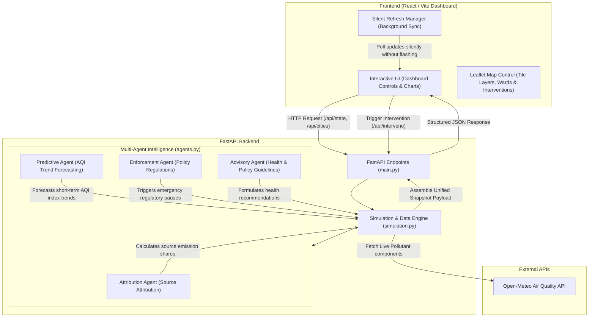

# 🌫️ AQI Intervention Platform

An AI-Powered Urban Air Quality Intelligence Platform built with a **FastAPI backend** (multi-agent intelligence layer + spatial data engine) and a **React/Vite frontend** (premium dark-mode command center dashboard).

---

## 🏗️ System Architecture & Implementation Journey

The platform has been engineered to provide real-time air quality tracking, simulation, and intelligent intervention recommendations across dozens of major Indian cities. Here is the architectural system overview followed by a summary of what has been accomplished:



### 1. Spatial Data Engine (`backend/simulation.py`)
* **Real Air Quality Integration**: Powered by the free **Open-Meteo Air Quality API**, bringing in live data rather than basic mock estimates.
* **Multi-City Support**: Comprehensive database configuration for dozens of major Indian cities, capital cities, and industrial centers (e.g., Bengaluru, Delhi, Mumbai, Chennai, Hyderabad, Kolkata, Pune, Ahmedabad, Lucknow, Jaipur, etc.).
* **Dynamic Wards & Fallback**: Each city is configured with real ward/locality coordinates and emission source maps. Includes automated interpolation and graceful fallback to statistical estimations if external APIs are unreachable.

### 2. Multi-Agent Intelligence Layer (`backend/agents.py`)
Four cooperative AI agents analyze AQI data, identify sources, predict future levels, enforce violations, and output public health/policy advisories:
* **Attribution Agent**: Parses real-time component measurements ($PM_{2.5}$, $PM_{10}$, $NO_2$, $SO_2$, $CO$, $O_3$) to attributes pollution weights dynamically between industrial, vehicular, construction, waste burning, and background sources.
* **Predictive Agent**: Forecasts short-term AQI trends and determines threshold breaches using temporal factors.
* **Enforcement Agent**: Analyzes source attributes and triggers targeted regulations (e.g., heavy vehicle bans, construction pauses, factory emission caps, street watering).
* **Advisory Agent**: Translates complex environmental metrics into actionable, localized health advisories for citizens and city administrators.

### 3. Premium Command Center Frontend (`frontend/src/App.jsx`)
* **Interactive Leaflet Mapping**: Dynamically visualizes real-time AQI levels across city wards using color-coded bubbles.
* **Multi-Layer Toggle**: Allows toggling between street layouts (CartoDB Voyager), deep dark overlays (CartoDB Dark Matter), and high-resolution satellite imagery (Esri/Google).
* **Silent Refreshing**: Periodic data updates synchronize background state seamlessly without full-page reloads, map flashes, or layout flickering.
* **Interactive Charting**: Implements beautiful visual charts showing source attribution breakdown, historical trends, and pollutant concentrations.
* **Real-time Simulation Panel**: Allows triggering spatial interventions and instantly viewing their modeled feedback loop in the dashboard.

### 4. Workspace Optimization & Cleanup
* Removed all deprecated and temporary scratch/test files (such as `test_waqi_*` scripts, old training notebooks, and untracked PDFs) to maintain code quality, leaving a clean, production-ready structure.
* Preserved foundational design documentation and user configuration profiles.

---

## 📖 How to Run the Application

### 1. Start the Backend Server (Terminal 1)

Navigate to the `backend` folder, install the required packages, and run the FastAPI server:

```powershell
# Navigate to the backend folder
Set-Location -LiteralPath "c:\Users\VINIL NAIK\OneDrive\Desktop\[PUB] India_runs_data_and_ai_challenge\AQI Intervention\backend"

# Install dependencies
pip install -r requirements.txt

# Launch development server
python -m uvicorn main:app --reload --port 8000
```
*API documentation will be accessible at http://localhost:8000/docs*

### 2. Start the Frontend Server (Terminal 2)

Navigate to the `frontend` folder, install npm dependencies, and start the Vite server:

```powershell
# Navigate to the frontend folder
Set-Location -LiteralPath "c:\Users\VINIL NAIK\OneDrive\Desktop\[PUB] India_runs_data_and_ai_challenge\AQI Intervention\frontend"

# Install node modules
npm install

# Start Vite dev server
npm run dev
```
*The interactive dashboard will open at http://localhost:5173/*
