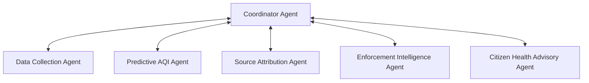
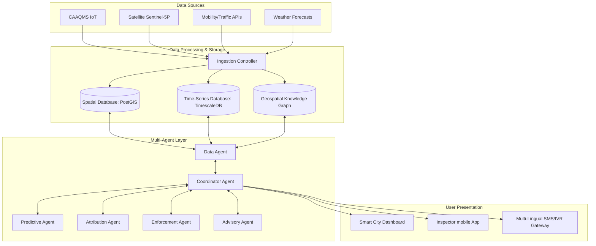
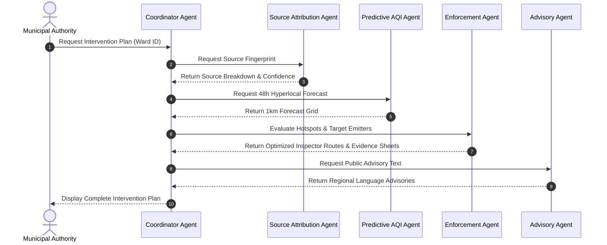
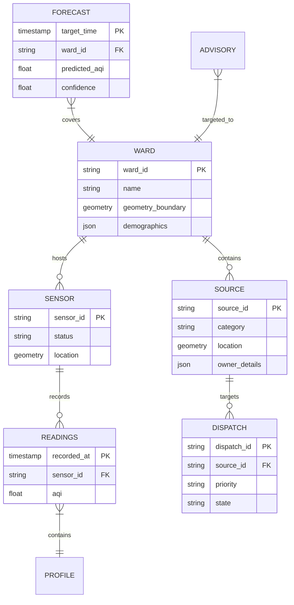
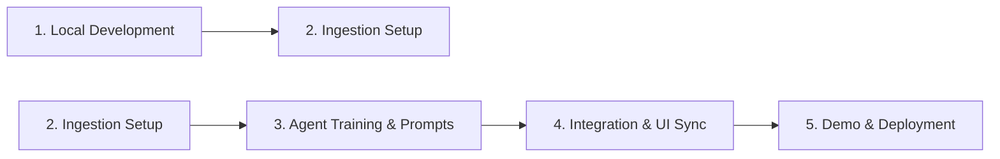

# Project Design & Architecture: AI-Powered Urban AQI Intervention Platform

This document presents the complete specification and design for **Project 5: AI-Powered Urban Air Quality Intelligence for Smart City Intervention**. It is structured to align with standard hackathon evaluation frameworks and software engineering best practices.

---

## 1. Problem Statement

India is facing a critical national urban air quality crisis. Despite deploying over 900 Continuous Ambient Air Quality Monitoring Stations (CAAQMS), **69% of monitored cities lack actionable, multi-agency response protocols**. 

Data is present but unacted upon. Traditional dashboards display historical or reactive data rather than enabling proactive, source-specific mitigation. 

### The Solution
This platform moves the city administration from **reactive monitoring** to **proactive, evidence-based intervention** by fusing monitoring station data, satellite imagery, mobility/traffic feeds, and land-use layers to trace pollution to its source, forecast localized trends, and optimize enforcement logistics.

---

## 2. Functional Requirements

### FR1. Data Acquisition
* **FR1.1**: The system shall collect real-time AQI data from CAAQMS stations every 5 minutes.
* **FR1.2**: The system shall ingest weather forecast data (wind speed, wind direction, temperature, humidity, boundary layer height).
* **FR1.3**: The system shall ingest traffic density and congestion index data for major city corridors.
* **FR1.4**: The system shall ingest active satellite imagery datasets (e.g., Sentinel-5P, MODIS thermal anomalies) to track atmospheric columns and active fires.

### FR2. Data Processing
* **FR2.1**: The system shall clean and normalize incoming heterogeneous geospatial and time-series data.
* **FR2.2**: The system shall handle missing or anomalous sensor values using spatio-temporal interpolation.
* **FR2.3**: The system shall aggregate air quality metrics dynamically at ward, zone, and city levels.

### FR3. AQI Monitoring
* **FR3.1**: The system shall display real-time AQI values on a web-based dashboard.
* **FR3.2**: The system shall visualize pollution hotspots using a geospatial heatmap layer.
* **FR3.3**: The system shall display concentration levels for individual pollutants (PM2.5, PM10, NO2, SO2, CO, O3).

### FR4. AQI Forecasting
* **FR4.1**: The system shall forecast overall AQI and key pollutant concentrations for 24, 48, and 72-hour horizons.
* **FR4.2**: The system shall project forecasts down to a hyperlocal 1km grid resolution and ward level.
* **FR4.3**: The system shall assign a statistical confidence score to each generated forecast.

### FR5. Pollution Source Attribution
* **FR5.1**: The system shall run attribution algorithms to identify the likely category of polluter (vehicular, industrial, construction dust, waste burning).
* **FR5.2**: The system shall calculate source contribution percentages for selected areas or hotspots.
* **FR5.3**: The system shall assign confidence intervals to each source attribution profile.

### FR6. Enforcement Intelligence
* **FR6.1**: The system shall flag and rank pollution hotspots exceeding safety thresholds that require immediate inspection.
* **FR6.2**: The system shall prioritize enforcement actions based on source attribution, severity, and proximity to sensitive receptors (hospitals, schools).
* **FR6.3**: The system shall auto-generate evidence-backed inspection reports (including coordinates, weather parameters, and historical patterns).

### FR7. Citizen Advisory
* **FR7.1**: The system shall generate personalized, health-risk-based citizen advisories.
* **FR7.2**: The system shall support translating advisories into multiple Indian languages (Hindi, Kannada, Tamil, etc.).
* **FR7.3**: The system shall publish alerts to mobile applications, web platforms, and public information displays.

### FR8. Analytics & Reporting
* **FR8.1**: The system shall generate historical AQI trends and seasonal pollution reports.
* **FR8.2**: The system shall provide side-by-side comparative views of pollution metrics across multiple cities.
* **FR8.3**: The system shall measure and report the effectiveness of historical interventions (e.g., road watering, construction pauses) on AQI trends.

### FR9. Alert Management
* **FR9.1**: The system shall generate automated alerts when AQI values cross critical thresholds.
* **FR9.2**: The system shall notify relevant municipal authorities via SMS, email, or webhook integrations.
* **FR9.3**: The system shall maintain a chronological history of all raised alerts and action states.

### FR10. User Management
* **FR10.1**: The system shall support Role-Based Access Control (RBAC) with defined roles: *Admin*, *Authority (Municipal Officers, Inspectors)*, and *Citizen*.
* **FR10.2**: The system shall authenticate users securely.
* **FR10.3**: The system shall maintain tamper-evident audit logs of all actions taken (e.g., alerts acknowledged, inspector dispatches, configuration changes).

---

## 3. Non-Functional Requirements (NFR)

* **NFR1: Performance & Real-time Constraints**: Raw CAAQMS telemetry must be processed and reflected on the dashboard within 5 minutes of ingestion.
* **NFR2: Scalability**: The system must scale horizontally to handle streams from up to 50 cities simultaneously without degradation of dashboard performance.
* **NFR3: Localization**: Health alerts and advisories must dynamically support localized dialects with a rendering latency of <2 seconds.
* **NFR4: Reliability**: The notification and alert system (FR9) must achieve a 99.95% delivery success rate.
* **NFR5: Auditability**: Generated enforcement logs and evidence sheets must be cryptographically signed to prevent retrospective alteration.

---

## 4. System Use Cases

### Use Case 1: Hyperlocal AQI Forecast Review
* **Actor**: Municipal Commissioner / Authority
* **Description**: The commissioner reviews the predictive 72-hour AQI map to schedule city-wide precautionary measures.
* **Flow**:
  1. Commissioner opens the dashboard and selects the 48h forecast overlay.
  2. The system queries forecasted grid points and flags a major particulate buildup in Ward 12.
  3. Commissioner views the confidence index and schedules mist-spraying trucks in that zone.

### Use Case 2: Hotspot Source Identification & Inspector Dispatch
* **Actor**: Environmental Safety Officer / Inspector
* **Description**: System detects a localized AQI spike, attributes it to a likely source, and dispatches an inspector.
* **Flow**:
  1. System flags an active AQI hotspot (AQI > 250) in an industrial sector.
  2. Source Attribution Agent identifies high probability of construction dust combined with low wind dispersion.
  3. System creates a prioritized task for the nearest inspector with an automatically compiled evidence sheet.
  4. Inspector receives the task, visits the site, verifies the violations, and updates the task status.

---

## 5. Multi-Agent Architecture

The core of the system is realized via a set of autonomous, specialized AI agents coordinated by a primary agent:

### Agent Roles & Responsibilities

1. **Coordinator Agent**: Orchestrates the workflow execution. It acts as the central router, receiving data updates, triggering specialized agents, compiling results, and serving them to the application APIs.
2. **Data Collection Agent**: Connects to external APIs (weather feeds, traffic providers, satellite portals, and CAAQMS networks). It performs sanity checks, flags offline sensors, and standardizes coordinates.
3. **Predictive AQI Agent**: Ingests weather variables and past AQI profiles. Executes dispersion models combined with neural sequence modeling to calculate the 1km grid forecast.
4. **Source Attribution Agent**: Ingests multi-spectral satellite indices, thermal anomaly counts, and corridor congestion metrics to execute the source-attribution model.
5. **Enforcement Intelligence Agent**: Evaluates prediction anomalies and historical compliance profiles to produce prioritized inspect-dispatch lists and compile evidence packages.
6. **Citizen Health Advisory Agent**: Combines forecast indexes with population vulnerability maps, generating localized, context-aware health advisories translated into targeted regional languages.

---

## 6. High-Level Design (HLD)

### 6.1 Component Design

### 6.2 Agent Sequence Diagram

### 6.3 Database Entity-Relationship Diagram (ERD)

---

## 7. Technology Stack

* **Frontend**: React (Vite), TailwindCSS, Leaflet.js / Mapbox GL (for map rendering), Chart.js (for analytics).
* **Backend**: Python (FastAPI), Uvicorn.
* **Storage**: PostgreSQL (with PostGIS extension) & TimescaleDB (for time-series metrics).
* **Agentic Framework**: LangGraph / AutoGen (Python).
* **AI & Numerical Models**: Scikit-Learn, PyTorch (spatial GNNs), and AERMOD wrapper libraries.

---

## 8. Development & Deployment Workflow

1. **Local Development**: Setting up the FastAPI backend and initializing React template.
2. **Ingestion Setup**: Configuring mock data streams for sensors, weather, and traffic to seed databases.
3. **Agent Training & Orchestration**: Defining prompts, LangGraph structures, and dispersion modeling computations.
4. **Integration**: Connecting agent decision pipelines to frontend UI charts and maps.
5. **Demo Deployment**: Deploying the prototype containerized using Docker or on a local web server for demonstration.

---

## 9. Demo Deliverables & Presentation Scope

The working prototype will demonstrate:
* **The Smart City Command Center**: Displaying real-time AQI readings, weather overlays, and spatial hotspots.
* **Interactive Timeline Simulation**: Sliding time forwards to trigger predictions and watching the heatmap update based on wind forecasts.
* **Attribution Breakdowns**: Clicking an active hotspot to show simulated source contributions.
* **Closed-loop Enforcement Action**: Auto-generating and showing a completed, professional inspection ticket (evidence sheet) sent to inspector portals.
* **Citizen Alert Broadcast**: A preview of citizen alerts generated in Kannada/Hindi based on selected region risks.
